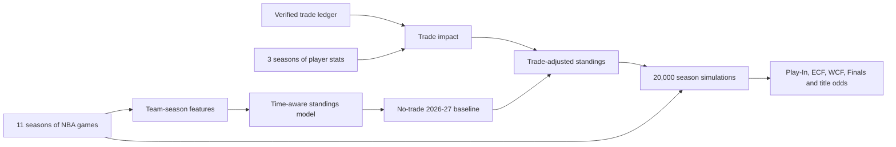

# CourtVision NBA

A reproducible, trade-aware NBA standings and playoff simulation pipeline for the 2026–27 season.

CourtVision combines verified transaction data, 11 seasons of NBA games, three seasons of player statistics, time-aware machine learning, transparent player-impact estimates, and 20,000 Monte Carlo simulations.

> Data snapshot verified through July 11, 2026. This is an analytical portfolio project, not betting advice.

## Current Results

### Championship favorites

| Rank | Team | Championship probability |
|---:|---|---:|
| 1 | San Antonio Spurs | 12.0% |
| 2 | Oklahoma City Thunder | 9.5% |
| 3 | Detroit Pistons | 9.1% |
| 4 | New York Knicks | 5.4% |
| 5 | Houston Rockets | 5.4% |

### Conference Finals probabilities

| Conference | Team | ECF/WCF probability |
|---|---|---:|
| West | San Antonio Spurs | 41.5% |
| West | Oklahoma City Thunder | 34.8% |
| West | Houston Rockets | 22.3% |
| East | Detroit Pistons | 34.8% |
| East | New York Knicks | 22.7% |
| East | Boston Celtics | 19.8% |

### Largest official trade adjustments

| Team | Estimated win change |
|---|---:|
| Washington Wizards | +1.74 |
| Philadelphia 76ers | +1.73 |
| Chicago Bulls | +1.67 |
| Miami Heat | +1.62 |
| Minnesota Timberwolves | -2.62 |
| Boston Celtics | -1.73 |

These adjustments measure player value transferred relative to a no-trade team baseline. They are estimates, not guarantees.

## Why This Project Exists

Offseason predictions often mix official trades, rumors, personal opinions, and unexplained ratings.

CourtVision handles them separately:

- Official transactions affect the default prediction.
- Reported transactions remain optional scenarios.
- On-hold transactions remain optional scenarios.
- Every traded player is joined using an NBA player ID.
- Draft assets stay in the ledger but do not pretend to score points next season.
- Model uncertainty is published instead of hidden.

## Pipeline



## Data Summary

- 13,209 regular-season games
- 11 NBA seasons from 2015–16 through 2025–26
- 30 teams per season
- 1,723 player-season records
- 802 unique players
- 40 of 40 traded players matched by NBA player ID
- 96 trade-asset rows
- 13 transactions
- 11 official transactions
- 2 non-official scenarios
- 20,000 postseason simulations

## Modeling Approach

### 1. Historical team baseline

Each team-season contains:

- Win percentage
- Points scored and allowed per game
- Average point margin
- Home and away performance
- Previous-season performance
- Two-season rolling performance

The model comparison uses a chronological split:

- Training: through 2023–24
- Validation and model selection: 2024–25
- Untouched final test: 2025–26

Ridge regression with `alpha=1` won the validation comparison.

| Evaluation | MAE |
|---|---:|
| 2024–25 validation | 8.16 wins |
| 2025–26 untouched test | 9.56 wins |

The test error is intentionally visible and becomes the uncertainty input for the simulator.

### 2. Player and trade impact

Player value uses the NBA Player Impact Estimate with:

- 2023–24 weight: 15%
- 2024–25 weight: 30%
- 2025–26 weight: 55%
- Playing-time adjustment
- Availability adjustment
- Replacement-level comparison

The transparent estimate is:

```text
estimated wins above replacement =
    (weighted PIE - replacement PIE)
    × minutes per game / 48
    × availability
    × 82
```

Team trade impact is zero-sum:

```text
team trade delta =
    value received - value sent
```

### 3. Monte Carlo postseason simulation

Each simulation:

1. Samples regular-season uncertainty using the honest 9.56-win test MAE.
2. Rebuilds East and West standings.
3. Simulates the NBA 7–10 Play-In format.
4. Simulates every best-of-seven series.
5. Applies a historical home-court advantage estimated from 13,209 games.
6. Records ECF, WCF, Finals, and championship outcomes.

The random seed is fixed, making published results reproducible.

## Reproduce the Project

### Requirements

- Python 3.11 or newer
- Internet access for the NBA data-download steps

### Installation

```bash
git clone YOUR_GITHUB_REPOSITORY_URL
cd courtvision-nba

python3 -m venv .venv
source .venv/bin/activate

python -m pip install --upgrade pip
python -m pip install -e ".[dev]"
```

Replace `YOUR_GITHUB_REPOSITORY_URL` after publishing the repository.

### Validate the transaction ledger

```bash
python src/courtvision/data/validate.py
```

### Build every dataset and prediction

```bash
python src/courtvision/data/fetch_games.py
python src/courtvision/data/fetch_player_stats.py
python src/courtvision/features/build_team_seasons.py
python src/courtvision/models/train_baseline.py
python src/courtvision/features/build_trade_impact.py
python src/courtvision/models/simulate.py
```

Raw downloads are cached. Re-running the pipeline does not download them again unless `--force` is used.

### Run quality checks

```bash
ruff check src scripts tests
python -m pytest
```

## Published Outputs

Small result snapshots are committed so visitors can inspect the findings without downloading the full NBA dataset:

- [Official 2026–27 standings](reports/official_standings_2026_27.csv)
- [Playoff and championship probabilities](reports/playoff_probabilities_2026_27.csv)
- [Traded-player impact estimates](reports/trade_player_impacts_2026.csv)
- [Simulation metadata](reports/simulation_metadata.json)

## Repository Structure

```text
courtvision-nba/
├── data/
│   ├── manual/                 # Verified transaction ledger
│   ├── raw/                    # Cached NBA downloads, ignored by Git
│   └── processed/              # Generated model datasets, ignored by Git
├── docs/
│   ├── data_dictionary.md
│   └── model_card.md
├── reports/                    # Small GitHub-visible result snapshots
├── scripts/                    # Reproducible ledger update scripts
├── src/courtvision/
│   ├── data/                   # Validation and download pipelines
│   ├── features/               # Team and trade feature engineering
│   └── models/                 # Baseline model and simulations
├── tests/
│   └── test_core.py
├── pyproject.toml
└── requirements.txt
```

## Engineering Safeguards

The test suite protects:

- Duplicate NBA matchup-label parsing
- Home-court probability behavior
- Reproducible best-of-seven simulations
- Correct Play-In advancement
- Exactly 1,230 league wins
- Zero-sum trade adjustments
- Valid postseason probability totals
- The verified transaction ledger

GitHub Actions runs Ruff and Pytest on every push and pull request.

## Limitations

- CourtVision models trades, not every free-agent signing, coaching change, or future injury.
- PIE is interpretable but does not perfectly capture defense, lineup fit, or role changes.
- Player availability uses historical data; future health remains uncertain.
- Draft picks are recorded but excluded from immediate on-court impact.
- The historical model’s untouched test error is 9.56 wins.
- Probabilities depend on the transaction snapshot date and must be regenerated when league data changes.

See the [model card](docs/model_card.md) for the complete methodology and limitations.

## License

Released under the [MIT License](LICENSE).