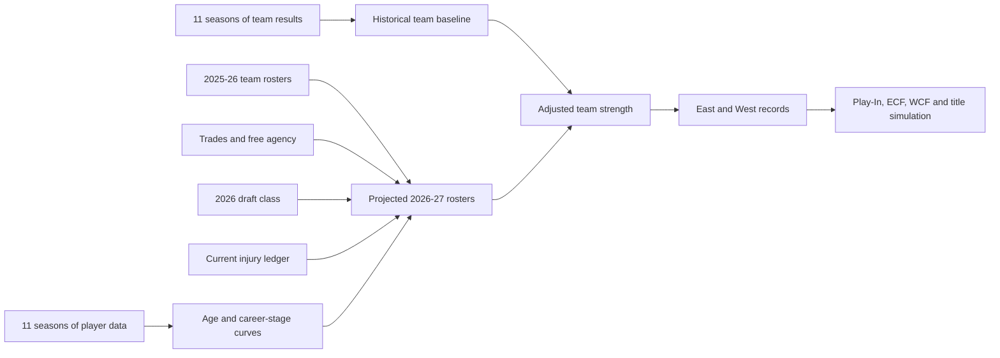

# CourtVision NBA

A reproducible 2026–27 NBA standings and postseason projection built from complete projected rosters—not isolated transaction bonuses.

> Revision 2 snapshot: July 15, 2026. The 2026 offseason remains active, so results should be rebuilt when rosters or injury updates change.

## Projected 2026–27 Eastern Conference Standings

| Seed | Team | Record |
|---:|---|---:|
| 1 | Detroit Pistons | **51–31** |
| 2 | Cleveland Cavaliers | **49–33** |
| 3 | New York Knicks | **48–34** |
| 4 | Charlotte Hornets | **47–35** |
| 5 | Boston Celtics | **46–36** |
| 6 | Orlando Magic | **45–37** |
| 7 | Philadelphia 76ers | **45–37** |
| 8 | Miami Heat | **45–37** |
| 9 | Toronto Raptors | **45–37** |
| 10 | Atlanta Hawks | **43–39** |
| 11 | Chicago Bulls | **35–47** |
| 12 | Milwaukee Bucks | **32–50** |
| 13 | Washington Wizards | **29–53** |
| 14 | Brooklyn Nets | **28–54** |
| 15 | Indiana Pacers | **28–54** |

## Projected 2026–27 Western Conference Standings

| Seed | Team | Record |
|---:|---|---:|
| 1 | Oklahoma City Thunder | **54–28** |
| 2 | San Antonio Spurs | **54–28** |
| 3 | Houston Rockets | **49–33** |
| 4 | Denver Nuggets | **49–33** |
| 5 | Los Angeles Lakers | **47–35** |
| 6 | Minnesota Timberwolves | **45–37** |
| 7 | Portland Trail Blazers | **43–39** |
| 8 | Phoenix Suns | **42–40** |
| 9 | Golden State Warriors | **38–44** |
| 10 | LA Clippers | **38–44** |
| 11 | New Orleans Pelicans | **34–48** |
| 12 | Dallas Mavericks | **34–48** |
| 13 | Utah Jazz | **30–52** |
| 14 | Memphis Grizzlies | **29–53** |
| 15 | Sacramento Kings | **28–54** |

## What Revision 2 Adds

CourtVision now projects every player expected on a 2026–27 roster. It includes:

- Official trades, free-agent moves, waivers, and draft-rights movement
- All 60 players selected in the 2026 NBA Draft
- Historical rookie expectations based on draft position
- Age and career-stage development curves
- Separate sophomore and third-year development groups
- Projected points per 36, minutes, and points per game
- Historical availability plus sourced current-injury overrides
- Low, base, and high injury scenarios
- Exactly 240 allocated regulation minutes per team
- Team-specific injury uncertainty in the Monte Carlo simulator

Summer League statistics receive **zero weight**. CourtVision does not treat a few Summer League games as equivalent to NBA performance.

## Data Snapshot

| Category | Count |
|---|---:|
| Historical regular-season games | 13,209 |
| Historical team seasons | 11 |
| Historical player seasons | 11 |
| Player-season records | 5,968 |
| Unique historical players | 1,554 |
| 2026 drafted rookies | 60 |
| Projected 2026–27 players | 592 |
| Projected teams | 30 |
| Current injury overrides | 4 |
| League wins | 1,230 |
| League losses | 1,230 |

## How It Works



### 1. Historical team baseline

The team model uses only information available before the season being predicted:

- Previous win percentage
- Previous points scored and allowed per game
- Previous average point margin
- Two-season win percentage
- Two-season average margin

| Split | Seasons |
|---|---|
| Training | Through 2023–24 |
| Validation | 2024–25 |
| Untouched test | 2025–26 |

Ridge regression with `alpha=1` won the validation comparison. Its untouched 2025–26 test error was **9.56 MAE wins**, which is carried into the simulations as forecast uncertainty.

### 2. Age and young-player development

Historical player seasons are paired chronologically. CourtVision measures how PIE, playing time, scoring rate, and availability changed from one season to the next.

The forecast groups are defined for **2026–27**:

- `ROOKIE`: entering NBA year 1
- `SOPHOMORE`: entering year 2
- `THIRD_YEAR`: entering year 3
- Veterans: grouped into age bands through `VETERAN_37_PLUS`

Career year is used first for sophomores and third-year players. Veteran age bands are used afterward, preventing separate age and youth bonuses from double-counting the same development.

Changes are shrunk toward the league mean to reduce small-sample noise. A development curve is used only if it beats a no-change forecast on the held-out 2025–26 player test.

| Target | No-change MAE | Curve MAE | Selected |
|---|---:|---:|---|
| PIE | 0.01734 | **0.01728** | Development curve |
| Minutes per game | 4.603 | **4.434** | Development curve |
| Points per 36 | 2.580 | **2.555** | Development curve |
| Availability | 0.2227 | **0.2199** | Development curve |

### 3. Consistent scoring projection

Raw PPG is not added as a second win bonus because PIE already contains scoring impact. That would double-count points.

Instead:

```text
points per 36 = points per game / minutes per game × 36

projected PPG = projected points per 36 × projected minutes / 36
```

This separates scoring rate from role and playing time. The projected PPG is published for explanation; complete player impact drives team wins.

### 4. Rookie impact

Rookies do not receive zero value and do not copy one specific prior rookie class. CourtVision learns expected PIE, minutes, scoring rate, and availability from the 2015–2025 draft classes.

The prior groups are:

- Picks 1–3
- Picks 4–10
- Picks 11–20
- Picks 21–30
- Second round
- Undrafted or international arrivals

The priors are shrunk toward the overall rookie mean. This limits the effect of unusually strong or weak historical draft groups.

### 5. Injuries and availability

Most players use historical availability and the held-out development curve. Known long-term injuries can override that estimate with sourced low, base, and high scenarios.

The current ledger includes Kyrie Irving, Jimmy Butler III, Moses Moody, and Dereck Lively II. Source facts and CourtVision assumptions are stored separately in `data/manual/injuries_2026.csv`.

The numerical ranges are modeling assumptions, not medical predictions. They must be updated when teams publish new information.

### 6. Full roster value

CourtVision begins with official 2025–26 team rosters, applies official movement ledgers, and adds the 2026 draft class. Projected season-average minutes are normalized to exactly 240 for every team.

```text
player value =
    (effective projected PIE - replacement PIE)
    × allocated season minutes / 48
    × 82

roster win delta =
    projected 2026-27 roster value
    - actual 2025-26 roster value

projected team wins =
    historical team baseline
    + roster win delta
```

Records are re-centered and rounded so the NBA contains exactly 1,230 wins, 1,230 losses, and 82 games per team.

### 7. Postseason simulation

The default simulation runs 20,000 seasons with a fixed seed. Each run samples:

- Historical team forecast error
- Team-specific injury uncertainty
- Play-In games
- Best-of-seven playoff series
- Historical home-court advantage

It reports Play-In, playoff, ECF/WCF, NBA Finals, and championship probabilities.

## Data Integrity

CourtVision keeps transaction states separate:

- `OFFICIAL`: included
- `REPORTED`: stored but excluded until finalized
- `ON_HOLD`: stored but excluded

Player movement uses NBA player IDs whenever available. The manual 2026 rookie ledger retains the official NBA source and verification date because the NBA statistics Draft History endpoint had not yet published the 2026 class when this snapshot was built.

Primary sources:

- [NBA 2026 Draft results](https://www.nba.com/news/2026-nba-draft-order)
- [NBA 2026 offseason tracker](https://www.nba.com/news/nba-offseason-deals-2026)
- [NBA 2026 trade tracker](https://www.nba.com/news/2026-offseason-trade-tracker)

## Published Results

- [Full 2026–27 standings](reports/official_standings_2026_27.csv)
- [Every player projection](reports/player_projections_2026_27.csv)
- [Team roster-value changes](reports/team_roster_deltas_2026_27.csv)
- [Age and development curves](reports/development_curves_2026_27.csv)
- [Held-out player backtest](reports/player_projection_backtest.csv)
- [Original trade-player estimates](reports/trade_player_impacts_2026.csv)

## Reproduce the Projection

```bash
git clone https://github.com/shreeyahi/court-vision-nba.git
cd court-vision-nba

python3 -m venv .venv
source .venv/bin/activate
python -m pip install --upgrade pip
python -m pip install -e ".[dev]"

python src/courtvision/data/validate.py
python src/courtvision/data/fetch_games.py
python src/courtvision/data/fetch_player_stats.py
python src/courtvision/data/fetch_projection_inputs.py
python src/courtvision/features/build_team_seasons.py
python src/courtvision/models/train_baseline.py
python src/courtvision/features/build_roster_projections.py
python src/courtvision/features/build_offseason_standings.py
python src/courtvision/models/simulate.py

ruff check src scripts tests
python -m pytest
```

Raw NBA downloads and generated processed files are cached locally and ignored by Git. Auditable result tables are published under `reports/`.

## Repository Structure

```text
court-vision-nba/
├── data/manual/
│   ├── trades_2026.csv
│   ├── roster_moves_2026.csv
│   ├── rookies_2026.csv
│   └── injuries_2026.csv
├── docs/
│   ├── data_dictionary.md
│   └── model_card.md
├── reports/
│   ├── official_standings_2026_27.csv
│   ├── player_projections_2026_27.csv
│   ├── team_roster_deltas_2026_27.csv
│   ├── development_curves_2026_27.csv
│   └── player_projection_backtest.csv
├── src/courtvision/
│   ├── data/
│   ├── features/
│   └── models/
└── tests/
```

## Limitations

- The 2026 offseason and injury-recovery process are still active.
- Injury ranges are transparent CourtVision scenarios, not medical forecasts.
- The rookie model uses draft-position priors and does not model college competition, position, or team fit directly.
- Summer League is intentionally excluded.
- PIE does not perfectly capture defense, lineup chemistry, coaching, or tactical fit.
- Projected roles can change during training camp.
- The untouched team-model error remains 9.56 wins, so close seed differences should not be treated as certain.
- These are model projections, not guaranteed outcomes or betting advice.

## License

Released under the [MIT License](LICENSE).
