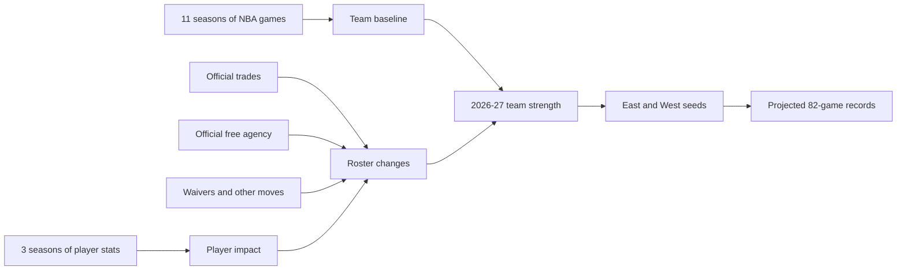

# CourtVision NBA

As an NBA enthusiast, the 25-26 offseason has had some crazy moves. From LaMelo to the Timberwolves to Giannis to the Heat. All these trades made me curious of each teams standings in the 2026–27 season. My projection utilizes official offseason trades, free-agent signings, waivers, and other team-changing roster moves.

> Offseason snapshot: July 11, 2026 at 5:52 PM GST. Reported and on-hold moves are excluded from the official projection until finalized.

## Projected 2026–27 Eastern Conference Standings

| Seed | Team | Record |
|---:|---|---:|
| 1 | Detroit Pistons | **53–29** |
| 2 | New York Knicks | **49–33** |
| 3 | Charlotte Hornets | **47–35** |
| 4 | Boston Celtics | **47–35** |
| 5 | Cleveland Cavaliers | **46–36** |
| 6 | Atlanta Hawks | **46–36** |
| 7 | Toronto Raptors | **45–37** |
| 8 | Orlando Magic | **45–37** |
| 9 | Philadelphia 76ers | **45–37** |
| 10 | Miami Heat | **45–37** |
| 11 | Chicago Bulls | **36–46** |
| 12 | Milwaukee Bucks | **31–51** |
| 13 | Brooklyn Nets | **28–54** |
| 14 | Washington Wizards | **28–54** |
| 15 | Indiana Pacers | **26–56** |

## Projected 2026–27 Western Conference Standings

| Seed | Team | Record |
|---:|---|---:|
| 1 | San Antonio Spurs | **57–25** |
| 2 | Oklahoma City Thunder | **54–28** |
| 3 | Houston Rockets | **49–33** |
| 4 | Denver Nuggets | **48–34** |
| 5 | Los Angeles Lakers | **45–37** |
| 6 | Phoenix Suns | **44–38** |
| 7 | Portland Trail Blazers | **43–39** |
| 8 | Minnesota Timberwolves | **43–39** |
| 9 | LA Clippers | **40–42** |
| 10 | Golden State Warriors | **38–44** |
| 11 | New Orleans Pelicans | **34–48** |
| 12 | Dallas Mavericks | **33–49** |
| 13 | Utah Jazz | **29–53** |
| 14 | Memphis Grizzlies | **29–53** |
| 15 | Sacramento Kings | **27–55** |

## What the Projection Includes

The default standings apply:

- Official offseason player trades
- Official free-agent moves between NBA teams
- Official sign-and-trades
- Official waiver claims
- Players joining from outside the NBA
- Historical player availability
- Three seasons of player-impact data
- Eleven seasons of team results

The default standings do not apply:

- Reported agreements that are not official
- On-hold transactions
- Re-signings, because the player remains on the same team
- Draft picks as immediate on-court production
- Unknown future injuries

## Offseason Movement Snapshot

| Category | Count |
|---|---:|
| Historical regular-season games | 13,209 |
| Historical NBA seasons | 11 |
| Player-season records | 1,723 |
| Unique players | 802 |
| Traded players matched by NBA ID | 40/40 |
| Official trade transactions | 11 |
| Official additional roster movements | 27 |
| Reported roster movements excluded | 5 |
| Projected teams | 30 |
| League wins | 1,230 |
| League losses | 1,230 |

## How It Works



### Step 1: Historical team baseline

CourtVision builds one report card for every team and season using:

- Win percentage
- Points scored per game
- Points allowed per game
- Average point margin
- Home and away performance
- Previous-season performance
- Two-season rolling performance

The model uses chronological evaluation:

| Split | Seasons |
|---|---|
| Training | Through 2023–24 |
| Validation | 2024–25 |
| Untouched test | 2025–26 |

Ridge regression with `alpha=1` won the validation comparison.

The untouched 2025–26 test mean absolute error was **9.56 wins**. This error is published rather than hidden.

### Step 2: Player impact

Player value uses recency-weighted NBA Player Impact Estimate, minutes, and availability.

| Season | Weight |
|---|---:|
| 2023–24 | 15% |
| 2024–25 | 30% |
| 2025–26 | 55% |

The transparent player estimate is:

```text
estimated wins above replacement =
    (weighted PIE - replacement PIE)
    × weighted minutes / 48
    × weighted availability
    × 82
```

### Step 3: Apply every official team change

For each team:

```text
offseason win adjustment =
    player value received
    - player value lost
```

The final projection is:

```text
projected team strength =
    historical team baseline
    + official trade adjustment
    + official free-agency adjustment
```

Records are normalized so the league contains exactly:

```text
1,230 wins
1,230 losses
82 games per team
```

## Data Integrity

CourtVision keeps transaction states separate:

- `OFFICIAL`: included in the default standings
- `REPORTED`: stored but excluded
- `ON_HOLD`: stored but excluded

Players are joined using official NBA player IDs rather than name matching.

The offseason source snapshot comes from the NBA’s league-wide tracker:

- [NBA 2026 offseason tracker](https://www.nba.com/news/nba-offseason-deals-2026)
- [NBA 2026 trade tracker](https://www.nba.com/news/2026-offseason-trade-tracker)

## Published Results

Visitors can inspect the final outputs without downloading the full historical dataset:

- [Full 2026–27 standings projection](reports/official_standings_2026_27.csv)
- [Official and reported roster-movement impacts](reports/roster_move_impacts_2026.csv)
- [Trade-player impact estimates](reports/trade_player_impacts_2026.csv)

## Reproduce the Projection

### Installation

```bash
git clone https://github.com/shreeyahi/court-vision-nba.git
cd court-vision-nba

python3 -m venv .venv
source .venv/bin/activate

python -m pip install --upgrade pip
python -m pip install -e ".[dev]"
```

### Run the pipeline

```bash
python src/courtvision/data/validate.py
python src/courtvision/data/fetch_games.py
python src/courtvision/data/fetch_player_stats.py
python src/courtvision/features/build_team_seasons.py
python src/courtvision/models/train_baseline.py
python src/courtvision/features/build_trade_impact.py
python src/courtvision/features/build_offseason_standings.py
```

Raw NBA downloads are cached locally and ignored by Git.

### Run quality checks

```bash
ruff check src scripts tests
python -m pytest
```

## Repository Structure

```text
court-vision-nba/
├── data/
│   ├── manual/
│   │   ├── trades_2026.csv
│   │   └── roster_moves_2026.csv
│   ├── raw/
│   └── processed/
├── docs/
│   ├── data_dictionary.md
│   └── model_card.md
├── reports/
│   ├── official_standings_2026_27.csv
│   ├── roster_move_impacts_2026.csv
│   └── trade_player_impacts_2026.csv
├── scripts/
├── src/courtvision/
│   ├── data/
│   ├── features/
│   └── models/
├── tests/
├── pyproject.toml
└── requirements.txt
```

## Limitations

- The 2026 offseason is still active.
- Results must be rebuilt when reported moves become official.
- Future injuries cannot be known.
- Player roles and minutes can change after joining a new team.
- PIE does not perfectly capture defense or lineup fit.
- New NBA players without historical NBA data receive a neutral initial impact.
- The historical model’s untouched test error is 9.56 wins.
- These are model projections, not guaranteed results or betting advice.

## License

Released under the [MIT License](LICENSE).
